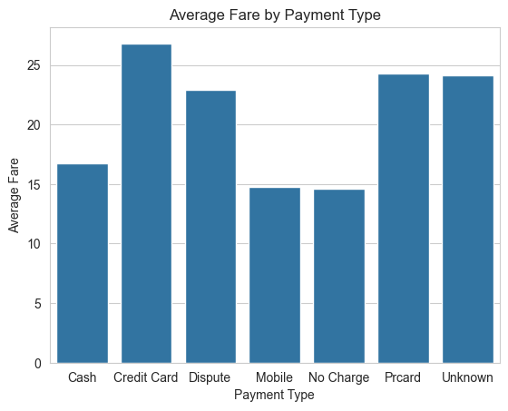
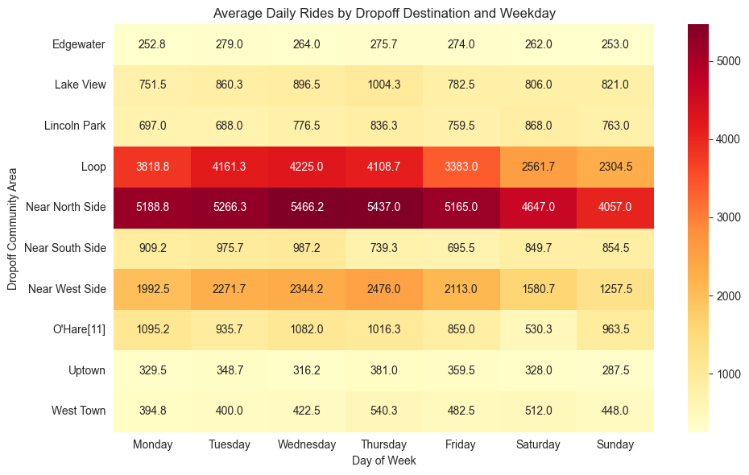
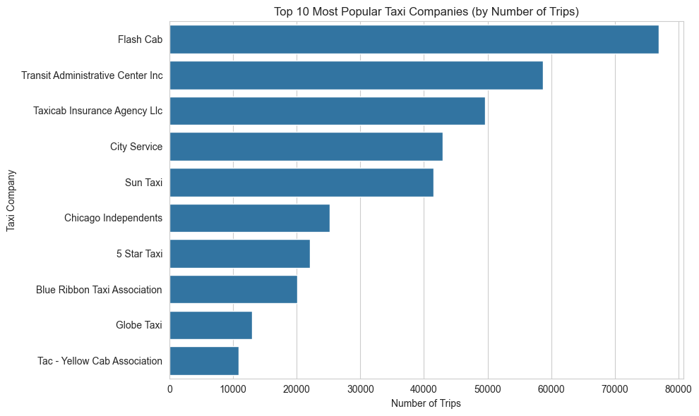
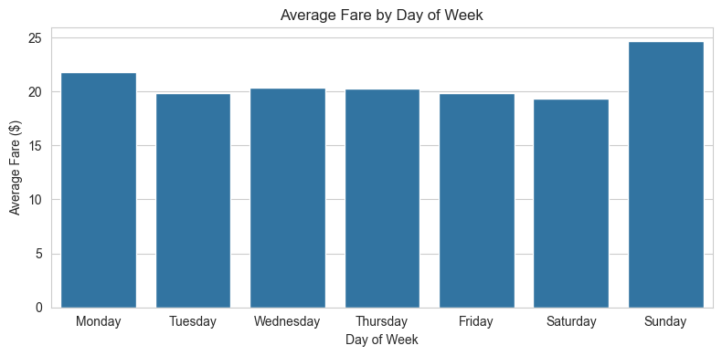
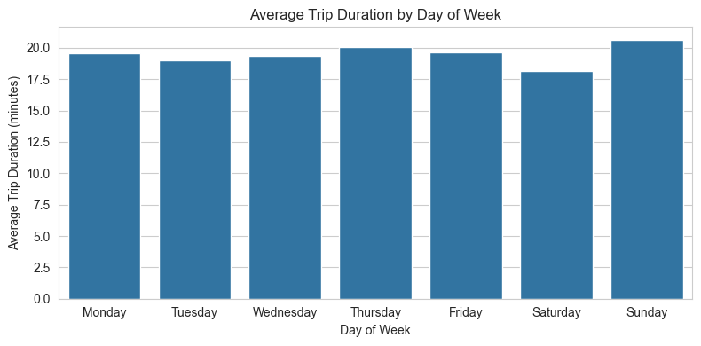

# Chicago Taxi Trips

## Overview
This project extracts, cleans, and analyzes Chicago taxi trip data with hourly weather data. 
The goal is to create a structured dataset for insights and visualizations.

---

## Data Sources
- *Chicago Taxi Trips API*: Taxi trip data with timestamps, fares, distances, company, payment type, and pickup/dropoff areas.  
- *Open-Meteo Weather API*: Hourly temperature, wind speed, rain, and precipitation.  
- *Community Areas (Wikipedia)*: Names and area codes of Chicago community areas.

---

## ETL Pipeline
1. *Extract*: Download taxi and weather data for a given date.  
2. *Transform*:  
   - Clean data and drop unnecessary columns.
   - Join weather data with taxi trips data.  
   - Update dimension tables (`company`, `payment_type`).  
3. *Load*: Upload fact and dimension tables to S3 and archive raw data.

---

## Data Model
- **Fact Table**: `fact_taxi_trips`  
  Data with fares, duration, distances, company & payment type IDs, pickup/dropoff areas, and weather info.  
- **Dimension Tables**: `dim_company`, `dim_payment_type`, `dim_weather`, `dim_community_areas`, `dim_date`.

---

## Visualizations

#### Average Fare by Payment Type

Shows which payment types are associated with higher or lower fares.

#### Popular Destinations by Weekday
  
Heatmap showing average daily rides per community area across weekdays.

#### Top 10 Taxi Companies
  
Most used taxi companies by number of trips.

#### Average Fare by Weekday
  
Shows fare trends during the week.

#### Average Trip Duration by Weekday
  
Average trip duration in minutes for each weekday.

---

## How to Run
1. Set AWS credentials and S3 access.  
2. Deploy the Lambda function to fetch, transform, and upload daily taxi and weather data.  
3. Use transformed data for analysis or visualizations.

---

